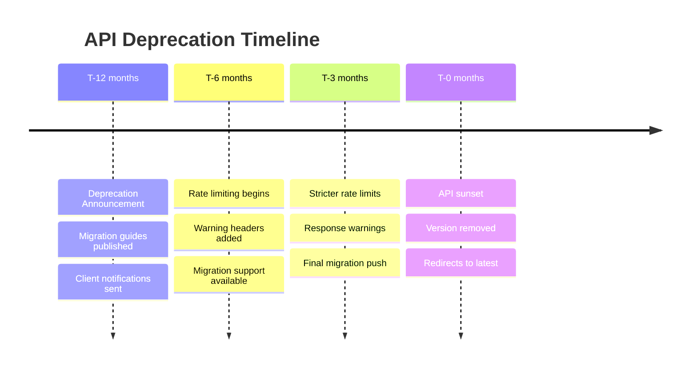
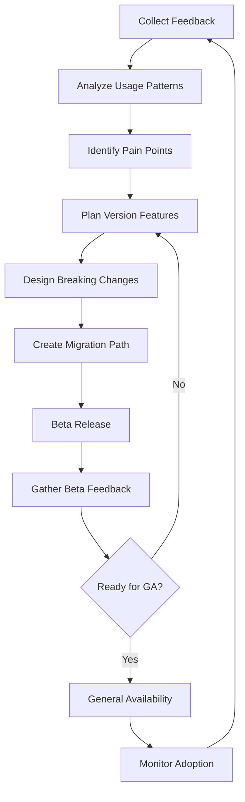

# API Versioning Strategy and Deprecation Policies
## Flight Data Pipeline API

This document outlines the comprehensive versioning strategy, deprecation policies, and lifecycle management for the Flight Data Pipeline API.

## 📋 Table of Contents

- [Versioning Strategy](#versioning-strategy)
- [Deprecation Policy](#deprecation-policy)
- [Breaking Changes](#breaking-changes)
- [Version Lifecycle](#version-lifecycle)
- [Migration Guidelines](#migration-guidelines)
- [Implementation Examples](#implementation-examples)
- [Client Support](#client-support)

## 🔢 Versioning Strategy

### Version Format

We use **Semantic Versioning (SemVer)** for API versions with the format `MAJOR.MINOR.PATCH`:

```
v1.2.3
├── 1: MAJOR version (breaking changes)
├── 2: MINOR version (backward-compatible features)
└── 3: PATCH version (backward-compatible fixes)
```

### Version Types

#### 1. URL Path Versioning (Primary)
```
https://api.flightdata-pipeline.com/v1/flights
https://api.flightdata-pipeline.com/v2/flights
```

**Advantages:**
- Clear and explicit versioning
- Easy to understand and implement
- Cacheable at the CDN level
- Version-specific documentation URLs

#### 2. Header Versioning (Alternative)
```http
GET /flights HTTP/1.1
Host: api.flightdata-pipeline.com
API-Version: v1.2
Accept: application/vnd.flightdata.v1+json
```

**Use Cases:**
- Internal API calls
- Fine-grained version control
- Beta feature testing

### Version Scoping

#### Major Version (v1, v2, v3...)
- **URL Path**: `/v1/`, `/v2/`
- **Scope**: Entire API surface
- **Triggers**: Breaking changes, architectural changes
- **Frequency**: 12-18 months

#### Minor Version (v1.1, v1.2...)
- **Header**: `API-Version: v1.2`
- **Scope**: New features, endpoints
- **Triggers**: New functionality, optional parameters
- **Frequency**: 2-4 months

#### Patch Version (v1.2.1, v1.2.2...)
- **Automatic**: No client action required
- **Scope**: Bug fixes, security patches
- **Triggers**: Bug fixes, performance improvements
- **Frequency**: As needed

## 📅 Version Lifecycle

### Support Timeline

| Version State | Duration | Support Level | Description |
|---------------|----------|---------------|-------------|
| **Current** | Indefinite | Full Support | Latest major version with all features |
| **Maintenance** | 18 months | Security + Critical Bugs | Previous major version |
| **Deprecated** | 12 months | Security Only | End-of-life announced |
| **Sunset** | 0 months | None | Version removed |

### Lifecycle Stages

#### 1. Development
- Internal testing and validation
- Breaking change identification
- Migration path planning

#### 2. Beta Release
```http
GET /v2-beta/flights HTTP/1.1
```
- Limited availability
- Feedback collection
- Performance testing

#### 3. General Availability (GA)
```http
GET /v2/flights HTTP/1.1
```
- Full production support
- Complete documentation
- Client SDK availability

#### 4. Maintenance
- Previous major version
- Security updates only
- Limited new features

#### 5. Deprecation
- 12-month notice period
- Active client migration support
- Deprecation warnings in responses

#### 6. Sunset
- API version removed
- Redirect to latest version
- Client error handling

## ⚠️ Deprecation Policy

### Deprecation Process

#### 1. Advance Notice (12+ months)
```json
{
  "flights": [...],
  "warnings": [
    {
      "type": "deprecation",
      "message": "API version v1 will be deprecated on 2024-12-31",
      "migration_guide": "https://docs.flightdata.com/migration/v1-to-v2",
      "sunset_date": "2025-12-31T00:00:00Z"
    }
  ]
}
```

#### 2. Deprecation Headers
```http
HTTP/1.1 200 OK
Sunset: Sat, 31 Dec 2025 00:00:00 GMT
Deprecation: Sat, 31 Dec 2024 00:00:00 GMT
Link: <https://docs.flightdata.com/migration/v1-to-v2>; rel="successor-version"
```

#### 3. Client Communication
- **Email notifications** to registered developers
- **Dashboard warnings** in developer portal
- **Blog posts** and changelog updates
- **Migration webinars** and support

#### 4. Gradual Restrictions
```json
{
  "error": {
    "code": "VERSION_DEPRECATED",
    "message": "API v1 is deprecated and will be sunset on 2025-12-31",
    "rate_limit_reduction": "50%",
    "migration_required": true
  }
}
```

### Deprecation Timeline



## 🚫 Breaking Changes

### What Constitutes a Breaking Change

#### Data Structure Changes
```json
// BREAKING: Removing fields
{
  "flight": {
    "icao24": "abc123",
    // "callsign": "SWR123" <- REMOVED
    "latitude": 47.123
  }
}

// BREAKING: Changing field types
{
  "timestamp": "2024-01-15T10:30:00Z", // Was: 1705318200 (Unix timestamp)
  "altitude": "35000.5" // Was: 35000 (integer)
}

// BREAKING: Restructuring nested objects
{
  "position": { // Was: flat structure
    "latitude": 47.123,
    "longitude": 8.456
  }
}
```

#### Endpoint Changes
```bash
# BREAKING: URL structure changes
OLD: GET /flights/{icao24}/history
NEW: GET /aircraft/{icao24}/flights

# BREAKING: HTTP method changes
OLD: GET /flights/search?query=...
NEW: POST /flights/search

# BREAKING: Required parameter additions
OLD: GET /flights (no required params)
NEW: GET /flights?region=REQUIRED
```

#### Behavior Changes
- **Status code modifications**: `200` → `202` for async operations
- **Rate limiting changes**: Reduced limits or new restrictions
- **Authentication requirements**: New auth methods required
- **Response format changes**: XML → JSON only

### Non-Breaking Changes

#### Safe Additions
```json
{
  "flight": {
    "icao24": "abc123",
    "callsign": "SWR123",
    "new_field": "optional_value" // ✅ Safe to add
  },
  "metadata": { // ✅ New optional section
    "api_version": "1.2.0",
    "request_id": "req_123"
  }
}
```

#### Safe Modifications
- **Optional parameter additions**
- **New endpoint additions**
- **Response enrichment** (additional optional fields)
- **Performance improvements**
- **Bug fixes** that don't change behavior

## 🔄 Migration Guidelines

### Migration Process

#### 1. Assessment Phase
```bash
# Check current API usage
curl -H "X-API-Key: $API_KEY" \
     "https://api.flightdata.com/v1/usage/summary"

# Response includes migration readiness
{
  "current_version": "v1.8.2",
  "recommended_version": "v2.1.0",
  "migration_complexity": "medium",
  "breaking_changes": 3,
  "estimated_effort": "2-4 weeks"
}
```

#### 2. Testing Phase
```python
# Parallel testing approach
import flight_data_sdk

# Current version client
v1_client = flight_data_sdk.Client(
    api_key="your-key",
    version="v1"
)

# New version client  
v2_client = flight_data_sdk.Client(
    api_key="your-key",
    version="v2"
)

# Compare responses
v1_flights = v1_client.get_flights()
v2_flights = v2_client.get_flights()

assert len(v1_flights) == len(v2_flights)
```

#### 3. Migration Strategies

##### Big Bang Migration
```yaml
# Complete migration in single deployment
deployment:
  strategy: big_bang
  steps:
    - update_all_clients: v1 → v2
    - deploy_simultaneously: true
    - rollback_plan: true
```

##### Gradual Migration  
```yaml
# Phased migration approach
deployment:
  strategy: gradual
  phases:
    - phase1: 10% traffic to v2
    - phase2: 50% traffic to v2  
    - phase3: 100% traffic to v2
  rollback_triggers:
    - error_rate: >5%
    - response_time: >2s
```

##### Shadow Migration
```python
# Run both versions in parallel
async def handle_request(request):
    # Primary response from v1
    v1_response = await v1_api.process(request)
    
    # Shadow request to v2 (async, no blocking)
    asyncio.create_task(
        v2_api.process(request).then(log_comparison)
    )
    
    return v1_response
```

### Migration Tools

#### 1. API Diff Tool
```bash
# Compare API versions
flight-data-cli diff v1 v2

# Output
Breaking Changes:
  - /flights: timestamp format changed (int → ISO string)
  - /flights/{id}: removed 'legacy_id' field
  
Compatible Changes:
  - /flights: added 'aircraft_info' object
  - /airports: added 'timezone' field
```

#### 2. Compatibility Checker
```python
from flight_data_tools import CompatibilityChecker

checker = CompatibilityChecker()
report = checker.analyze_migration(
    from_version="v1.8",
    to_version="v2.0",
    client_code_path="./src"
)

print(f"Compatibility Score: {report.compatibility_score}/100")
print(f"Required Changes: {len(report.breaking_changes)}")
```

#### 3. Migration Assistant
```bash
# Automated code migration
flight-data-migrate --from=v1 --to=v2 --path=./src

# Generated changes:
# - Updated import statements
# - Modified field access patterns  
# - Added error handling for new responses
# - Updated test cases
```

## 💻 Implementation Examples

### Version Detection
```python
class FlightDataClient:
    def __init__(self, api_key: str, version: str = "latest"):
        self.api_key = api_key
        self.version = self._resolve_version(version)
        self.base_url = f"https://api.flightdata.com/{self.version}"
    
    def _resolve_version(self, version: str) -> str:
        if version == "latest":
            return self._get_latest_version()
        return version
    
    def _get_latest_version(self) -> str:
        response = requests.get(
            "https://api.flightdata.com/versions"
        )
        return response.json()["latest_stable"]
```

### Graceful Degradation
```python
async def get_flight_data(self, icao24: str):
    try:
        # Try v2 format first
        response = await self._make_request(f"v2/flights/{icao24}")
        return self._parse_v2_response(response)
    
    except UnsupportedVersion:
        # Fall back to v1
        response = await self._make_request(f"v1/flights/{icao24}")
        return self._parse_v1_response(response)
    
    except Exception as e:
        logger.error(f"Failed to fetch flight data: {e}")
        raise
```

### Version-Aware Error Handling
```python
class APIError(Exception):
    def __init__(self, message: str, status_code: int, api_version: str):
        super().__init__(message)
        self.status_code = status_code
        self.api_version = api_version
    
    @property
    def is_version_related(self) -> bool:
        return self.status_code in [410, 426, 505]  # Gone, Upgrade Required, Version Not Supported

def handle_api_error(error: APIError):
    if error.is_version_related:
        return suggest_version_upgrade(error.api_version)
    else:
        return handle_generic_error(error)
```

## 🛠️ Client Support

### SDK Version Compatibility Matrix

| Client SDK Version | API v1 | API v2 | API v3 |
|-------------------|--------|--------|--------|
| Python SDK 1.x    | ✅ Full | ❌ None | ❌ None |
| Python SDK 2.x    | ✅ Full | ✅ Full | ❌ None |
| Python SDK 3.x    | ⚠️ Limited | ✅ Full | ✅ Full |
| JavaScript SDK 1.x | ✅ Full | ❌ None | ❌ None |
| JavaScript SDK 2.x | ✅ Full | ✅ Full | ⚠️ Beta |

### Client Configuration Examples

#### Python SDK
```python
# Automatic version detection
client = FlightDataClient(
    api_key="your-key",
    auto_version=True  # Uses latest supported version
)

# Explicit version pinning  
client = FlightDataClient(
    api_key="your-key",
    version="v1.8",  # Pin to specific version
    strict_mode=False  # Allow graceful degradation
)

# Migration mode
client = FlightDataClient(
    api_key="your-key",
    migration_mode={
        "from": "v1",
        "to": "v2", 
        "parallel_testing": True
    }
)
```

#### JavaScript SDK
```javascript
// Version selection
const client = new FlightDataClient({
  apiKey: 'your-key',
  version: 'v2',
  fallbackVersions: ['v1.9', 'v1.8'], // Try these if v2 fails
  retryOnVersionError: true
});

// Migration helper
await client.migrate({
  targetVersion: 'v2',
  testPhase: true,  // Run in parallel for comparison
  migrationCallback: (progress) => {
    console.log(`Migration ${progress.percent}% complete`);
  }
});
```

### Backward Compatibility Adapter

```python
class BackwardCompatibilityAdapter:
    """Adapter to maintain v1 interface while using v2 API"""
    
    def __init__(self, v2_client):
        self.v2_client = v2_client
    
    def get_flights(self, **kwargs):
        """v1-compatible method signature"""
        # Translate v1 parameters to v2 format
        v2_params = self._translate_params(kwargs)
        
        # Call v2 API
        v2_response = self.v2_client.get_flights(**v2_params)
        
        # Transform response to v1 format
        return self._transform_to_v1(v2_response)
    
    def _translate_params(self, v1_params):
        """Convert v1 parameter format to v2"""
        translation_map = {
            'lamin': 'bounds.lat_min',
            'lamax': 'bounds.lat_max',
            'lomin': 'bounds.lon_min', 
            'lomax': 'bounds.lon_max'
        }
        
        v2_params = {}
        for v1_key, v1_value in v1_params.items():
            v2_key = translation_map.get(v1_key, v1_key)
            
            # Handle nested parameter structure
            if '.' in v2_key:
                parent, child = v2_key.split('.')
                if parent not in v2_params:
                    v2_params[parent] = {}
                v2_params[parent][child] = v1_value
            else:
                v2_params[v2_key] = v1_value
        
        return v2_params
```

## 📊 Monitoring and Metrics

### Version Usage Analytics
```yaml
metrics:
  version_adoption:
    - version: "v1"
      usage_percentage: 45%
      trend: "declining"
      active_clients: 1250
    
    - version: "v2" 
      usage_percentage: 55%
      trend: "growing"
      active_clients: 1870
  
  migration_progress:
    total_clients: 3120
    migrated_clients: 1870
    migration_rate: "60%"
    estimated_completion: "2024-06-15"
```

### Deprecation Tracking
```python
# Track deprecated endpoint usage
@track_deprecation
def legacy_endpoint():
    emit_metric("api.deprecated.endpoint.used", {
        "endpoint": "/v1/flights/search",
        "client_id": request.client_id,
        "migration_deadline": "2024-12-31"
    })
    
    return handle_legacy_request()
```

### Migration Success Metrics
- **Migration Completion Rate**: Percentage of clients successfully migrated
- **API Error Rate by Version**: Track error rates across versions
- **Response Time Comparison**: Performance across API versions
- **Client Satisfaction**: Feedback scores during migration
- **Support Ticket Volume**: Migration-related issues

## 🔄 Continuous Improvement

### Version Planning Process



### Feedback Integration
- **Developer Surveys**: Quarterly API satisfaction surveys
- **Usage Analytics**: Data-driven decision making
- **Community Forums**: Open discussions on API evolution
- **Advisory Board**: Key client input on major changes
- **Beta Programs**: Early access for testing and feedback

---

## 📞 Support and Resources

### Migration Support
- **Email**: api-migration@flightdata.com
- **Slack**: #api-migration channel
- **Office Hours**: Weekly migration support sessions
- **Documentation**: https://docs.flightdata.com/migration

### Resources
- **Changelog**: https://docs.flightdata.com/changelog
- **Migration Guides**: https://docs.flightdata.com/migration
- **API Status**: https://status.flightdata.com
- **Developer Portal**: https://developers.flightdata.com

### Emergency Contacts
- **Critical Issues**: emergency@flightdata.com
- **Security Vulnerabilities**: security@flightdata.com  
- **On-call Support**: +1-555-FLIGHT (24/7)

---

This versioning strategy ensures smooth API evolution while maintaining developer trust and minimizing disruption to existing integrations.