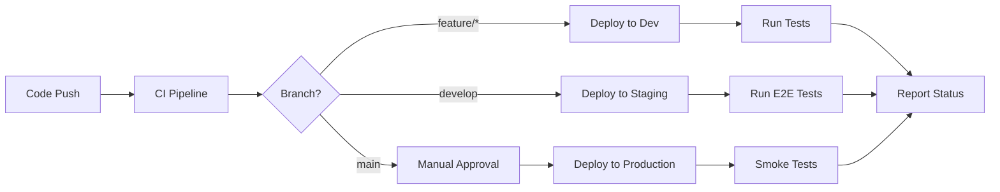

# Developer Guide
## Flight Data Pipeline System

### 📋 Table of Contents

- [Development Environment Setup](#development-environment-setup)
- [Project Structure](#project-structure)
- [Local Development](#local-development)
- [Testing Guide](#testing-guide)
- [Deployment Process](#deployment-process)
- [Contributing Guidelines](#contributing-guidelines)
- [Code Standards](#code-standards)
- [Debugging and Troubleshooting](#debugging-and-troubleshooting)

## 🛠️ Development Environment Setup

### Prerequisites

#### System Requirements
```yaml
Operating System: macOS, Linux, or Windows with WSL2
Python: 3.11 or higher
Node.js: 18.x or higher (for frontend development)
Docker: 20.x or higher
Git: 2.30 or higher
```

#### Required Tools
```bash
# AWS CLI
curl "https://awscli.amazonaws.com/AWSCLIV2.pkg" -o "AWSCLIV2.pkg"
sudo installer -pkg AWSCLIV2.pkg -target /

# AWS CDK
npm install -g aws-cdk

# Poetry (Python dependency management)
curl -sSL https://install.python-poetry.org | python3 -

# Docker Compose
# Usually included with Docker Desktop

# Pre-commit (Code quality)
pip install pre-commit
```

### AWS Account Setup

#### 1. Create AWS Account and IAM User
```bash
# Create development IAM user with permissions:
# - AdministratorAccess (for development)
# - Or use the principle of least privilege with these policies:
cat > dev-policy.json << EOF
{
  "Version": "2012-10-17",
  "Statement": [
    {
      "Effect": "Allow",
      "Action": [
        "lambda:*",
        "dynamodb:*",
        "s3:*",
        "apigateway:*",
        "iam:*",
        "cloudformation:*",
        "events:*",
        "logs:*"
      ],
      "Resource": "*"
    }
  ]
}
EOF
```

#### 2. Configure AWS CLI
```bash
aws configure
# AWS Access Key ID: AKIA******************
# AWS Secret Access Key: ****************************************
# Default region name: us-east-1
# Default output format: json

# Verify configuration
aws sts get-caller-identity
```

### Repository Setup

#### 1. Clone and Initialize
```bash
# Clone repository
git clone https://github.com/your-org/flightdata-project.git
cd flightdata-project

# Install pre-commit hooks
pre-commit install

# Create development branch
git checkout -b develop
```

#### 2. Environment Configuration
```bash
# Copy environment template
cp .env.example .env.dev

# Edit environment variables
cat > .env.dev << EOF
# AWS Configuration
AWS_REGION=us-east-1
AWS_ACCOUNT_ID=123456789012

# Environment Settings
ENVIRONMENT=dev
LOG_LEVEL=DEBUG

# External API Keys
OPENSKY_API_USERNAME=your-username
OPENSKY_API_PASSWORD=your-password

# Database Settings
DYNAMODB_ENDPOINT=http://localhost:8000  # For local DynamoDB
REDIS_ENDPOINT=redis://localhost:6379

# API Configuration
API_BASE_URL=http://localhost:3000
CORS_ORIGINS=http://localhost:3000,http://localhost:8080

# Testing
TEST_DATA_PATH=./tests/fixtures
MOCK_EXTERNAL_APIS=true
EOF
```

## 📁 Project Structure

```
flightdata-project/
├── 📁 backend/                    # Backend Lambda functions
│   ├── 📁 functions/              # Individual Lambda functions
│   │   ├── 📁 flight-data-fetcher/
│   │   │   ├── handler.py         # Main Lambda handler
│   │   │   ├── requirements.txt   # Function dependencies
│   │   │   └── tests/            # Function-specific tests
│   │   ├── 📁 flight-data-processor/
│   │   ├── 📁 flight-api/
│   │   └── 📁 analytics-processor/
│   ├── 📁 shared/                # Shared libraries and utilities
│   │   ├── 📁 models/            # Data models and schemas
│   │   ├── 📁 utils/             # Utility functions
│   │   ├── 📁 clients/           # External API clients
│   │   └── 📁 validation/        # Data validation schemas
│   └── 📁 tests/                 # Integration and unit tests
│       ├── 📁 unit/              # Unit tests
│       ├── 📁 integration/       # Integration tests
│       └── 📁 fixtures/          # Test data and mocks
│
├── 📁 frontend/                  # React dashboard (optional)
│   ├── 📁 src/
│   │   ├── 📁 components/        # React components
│   │   ├── 📁 pages/             # Page components
│   │   ├── 📁 hooks/             # Custom React hooks
│   │   ├── 📁 services/          # API client services
│   │   └── 📁 utils/             # Frontend utilities
│   ├── 📁 public/                # Static assets
│   └── 📁 tests/                 # Frontend tests
│
├── 📁 infrastructure/            # AWS CDK infrastructure code
│   ├── 📁 lib/                   # CDK stack definitions
│   │   ├── database-stack.ts     # DynamoDB and caching
│   │   ├── api-stack.ts          # API Gateway and Lambda
│   │   ├── processing-stack.ts   # Data processing pipeline
│   │   └── monitoring-stack.ts   # CloudWatch and alerting
│   ├── app.ts                    # CDK app entry point
│   ├── cdk.json                  # CDK configuration
│   └── 📁 tests/                 # Infrastructure tests
│
├── 📁 docs/                      # Documentation
│   ├── api/                      # API documentation
│   ├── technical-architecture.md # System design
│   ├── user-guide.md             # User documentation
│   └── developer-guide.md        # This file
│
├── 📁 scripts/                   # Development and deployment scripts
│   ├── setup-dev-env.sh          # Development setup
│   ├── run-tests.sh              # Test runner
│   ├── deploy.sh                 # Deployment script
│   └── generate-test-data.py     # Test data generation
│
├── 📁 tests/                     # System-level tests
│   ├── 📁 load/                  # Load testing
│   ├── 📁 smoke/                 # Smoke tests
│   └── 📁 e2e/                   # End-to-end tests
│
├── 📄 pyproject.toml             # Python project configuration
├── 📄 package.json               # Node.js dependencies (CDK)
├── 📄 docker-compose.yml         # Local services
├── 📄 .env.example               # Environment template
├── 📄 .pre-commit-config.yaml    # Code quality hooks
└── 📄 README.md                  # Project overview
```

### Key Files and Their Purposes

#### Backend Structure
```yaml
handler.py:
  Purpose: Lambda function entry point
  Pattern: Single responsibility per handler
  Example:
    def lambda_handler(event, context):
        """Main Lambda handler function"""
        
requirements.txt:
  Purpose: Function-specific dependencies
  Note: Keep minimal to reduce cold start time

shared/models/:
  Purpose: Pydantic models for data validation
  Example: FlightData, Airport, APIResponse models
  
shared/clients/:
  Purpose: External API client wrappers
  Example: OpenSkyClient, AirportsClient
```

#### Infrastructure Structure  
```yaml
CDK Stacks:
  database-stack.ts: DynamoDB tables, ElastiCache
  api-stack.ts: API Gateway, Lambda functions
  processing-stack.ts: EventBridge, Step Functions
  monitoring-stack.ts: CloudWatch, Alarms

Organization:
  - One stack per logical component
  - Environment-specific configurations
  - Resource naming conventions
  - IAM policies and roles
```

## 💻 Local Development

### Development Services

#### 1. Start Local Services
```bash
# Start all local services
docker-compose up -d

# Services included:
# - DynamoDB Local (port 8000)
# - Redis (port 6379)
# - LocalStack (AWS services, port 4566)

# Verify services are running
docker-compose ps
```

#### 2. Initialize Local Database
```bash
# Create DynamoDB tables locally
python scripts/setup-local-db.py

# Load test data
python scripts/load-test-data.py --environment=local

# Verify tables created
aws dynamodb list-tables --endpoint-url http://localhost:8000
```

### Backend Development

#### 1. Set up Python Environment
```bash
# Install Poetry dependencies
cd backend/
poetry install

# Activate virtual environment
poetry shell

# Install development dependencies
poetry install --with dev,test
```

#### 2. Run Individual Functions Locally
```bash
# Flight data fetcher
cd backend/functions/flight-data-fetcher/
poetry run python -m pytest tests/
poetry run python handler.py  # Local execution

# API handler with local server
cd backend/functions/flight-api/
poetry run python -m uvicorn app:app --reload --port 8001
```

#### 3. SAM Local Development (Alternative)
```bash
# Install SAM CLI
brew install aws-sam-cli

# Build and start local API
sam build
sam local start-api --port 3001

# Invoke function locally
sam local invoke FlightDataFetcher --event events/sample-event.json
```

### Frontend Development

#### 1. Setup React Development
```bash
cd frontend/
npm install

# Start development server
npm start
# Opens http://localhost:3000

# Run with API proxy
REACT_APP_API_URL=http://localhost:8001 npm start
```

#### 2. Frontend Testing
```bash
# Run tests
npm test

# Run with coverage
npm test -- --coverage

# E2E tests with Cypress
npm run cypress:open
```

### Development Workflow

#### 1. Feature Development Process
```bash
# 1. Create feature branch
git checkout develop
git pull origin develop
git checkout -b feature/flight-search-enhancement

# 2. Make changes and test locally
# Edit code, run tests, verify functionality

# 3. Run quality checks
pre-commit run --all-files

# 4. Commit changes
git add .
git commit -m "feat: add advanced flight search filtering

- Add aircraft type filtering
- Implement airline code search
- Add date range validation
- Update API documentation"

# 5. Push and create PR
git push origin feature/flight-search-enhancement
# Create Pull Request on GitHub
```

#### 2. Code Quality Automation
```yaml
Pre-commit hooks:
  - black: Python code formatting
  - isort: Import sorting
  - flake8: Python linting
  - mypy: Type checking
  - eslint: JavaScript linting
  - prettier: JavaScript formatting
  - pytest: Run tests before commit

Configuration (.pre-commit-config.yaml):
repos:
  - repo: https://github.com/psf/black
    rev: 23.1.0
    hooks:
      - id: black
        language_version: python3.11
  
  - repo: https://github.com/pycqa/isort
    rev: 5.12.0
    hooks:
      - id: isort
        args: ["--profile", "black"]
```

## 🧪 Testing Guide

### Testing Strategy

#### Test Pyramid
```
                    E2E Tests
                   (Cypress, Playwright)
                  /                    \
              Integration Tests         API Tests  
            (pytest, requests)       (Postman, pytest)
           /                    \    /                    \
      Unit Tests              Component Tests         Contract Tests
   (pytest, jest)           (React Testing Lib)      (Pact, OpenAPI)
```

### Unit Testing

#### Backend Unit Tests
```python
# Example: backend/functions/flight-api/tests/test_handler.py
import pytest
from unittest.mock import patch, MagicMock
from handler import lambda_handler, validate_coordinates

class TestFlightAPIHandler:
    """Test suite for flight API handler"""
    
    def test_validate_coordinates_valid(self):
        """Test coordinate validation with valid inputs"""
        result = validate_coordinates(45.8, 47.8, 5.9, 10.5)
        assert result is True
    
    def test_validate_coordinates_invalid_latitude(self):
        """Test coordinate validation with invalid latitude"""
        with pytest.raises(ValueError, match="Invalid latitude"):
            validate_coordinates(91.0, 47.8, 5.9, 10.5)
    
    @patch('handler.dynamodb_client')
    def test_get_flights_success(self, mock_dynamodb):
        """Test successful flight data retrieval"""
        # Arrange
        mock_dynamodb.query.return_value = {
            'Items': [
                {'icao24': '4ca7b4', 'callsign': 'SWR123', 'latitude': 46.5}
            ]
        }
        
        event = {
            'queryStringParameters': {
                'lamin': '45.8', 'lamax': '47.8',
                'lomin': '5.9', 'lomax': '10.5'
            }
        }
        
        # Act
        response = lambda_handler(event, {})
        
        # Assert
        assert response['statusCode'] == 200
        body = json.loads(response['body'])
        assert len(body['flights']) == 1
        assert body['flights'][0]['icao24'] == '4ca7b4'
    
    @patch('handler.dynamodb_client')
    def test_get_flights_database_error(self, mock_dynamodb):
        """Test handling of database errors"""
        # Arrange
        mock_dynamodb.query.side_effect = Exception("Database connection failed")
        
        event = {'queryStringParameters': {'lamin': '45.8'}}
        
        # Act
        response = lambda_handler(event, {})
        
        # Assert
        assert response['statusCode'] == 500
        body = json.loads(response['body'])
        assert 'error' in body

# Run tests
# cd backend/functions/flight-api/
# poetry run pytest tests/ -v --cov=handler --cov-report=html
```

#### Frontend Unit Tests
```javascript
// Example: frontend/src/components/FlightMap.test.tsx
import React from 'react';
import { render, screen, fireEvent, waitFor } from '@testing-library/react';
import '@testing-library/jest-dom';
import { FlightMap } from './FlightMap';
import * as flightService from '../services/flightService';

// Mock the flight service
jest.mock('../services/flightService');

describe('FlightMap Component', () => {
  beforeEach(() => {
    jest.clearAllMocks();
  });

  test('renders map container', () => {
    render(<FlightMap />);
    const mapContainer = screen.getByTestId('flight-map');
    expect(mapContainer).toBeInTheDocument();
  });

  test('loads flights on mount', async () => {
    const mockFlights = [
      { icao24: '4ca7b4', latitude: 46.5, longitude: 7.1, callsign: 'SWR123' }
    ];
    
    (flightService.getFlights as jest.Mock).mockResolvedValue({
      flights: mockFlights
    });

    render(<FlightMap />);

    await waitFor(() => {
      expect(flightService.getFlights).toHaveBeenCalledWith({
        lamin: expect.any(Number),
        lamax: expect.any(Number),
        lomin: expect.any(Number),
        lomax: expect.any(Number)
      });
    });
  });

  test('handles flight selection', async () => {
    const mockFlights = [
      { icao24: '4ca7b4', latitude: 46.5, longitude: 7.1, callsign: 'SWR123' }
    ];
    
    (flightService.getFlights as jest.Mock).mockResolvedValue({
      flights: mockFlights
    });

    render(<FlightMap />);

    await waitFor(() => {
      const flightMarker = screen.getByTestId('flight-4ca7b4');
      fireEvent.click(flightMarker);
    });

    expect(screen.getByText('SWR123')).toBeInTheDocument();
  });
});

// Run tests
// npm test -- --coverage --watchAll=false
```

### Integration Testing

#### API Integration Tests
```python
# Example: backend/tests/integration/test_api_integration.py
import pytest
import requests
import json
from datetime import datetime, timedelta

class TestFlightAPIIntegration:
    """Integration tests for Flight Data API"""
    
    @pytest.fixture
    def api_base_url(self):
        """Base URL for API testing"""
        return "http://localhost:3001/v1"
    
    @pytest.fixture
    def api_headers(self):
        """Standard headers for API requests"""
        return {
            'X-API-Key': 'test-api-key',
            'Content-Type': 'application/json'
        }
    
    def test_health_endpoint(self, api_base_url):
        """Test API health check"""
        response = requests.get(f"{api_base_url}/health")
        assert response.status_code == 200
        
        data = response.json()
        assert data['status'] == 'healthy'
        assert 'version' in data
        assert 'timestamp' in data
    
    def test_get_flights_with_bounds(self, api_base_url, api_headers):
        """Test flight retrieval with geographic bounds"""
        params = {
            'lamin': 45.8,
            'lamax': 47.8,
            'lomin': 5.9,
            'lomax': 10.5,
            'limit': 10
        }
        
        response = requests.get(
            f"{api_base_url}/flights",
            params=params,
            headers=api_headers
        )
        
        assert response.status_code == 200
        data = response.json()
        
        assert 'flights' in data
        assert 'pagination' in data
        assert isinstance(data['flights'], list)
        assert len(data['flights']) <= 10
        
        # Validate flight data structure
        if data['flights']:
            flight = data['flights'][0]
            required_fields = ['icao24', 'latitude', 'longitude', 'timestamp']
            for field in required_fields:
                assert field in flight
    
    def test_get_flights_invalid_coordinates(self, api_base_url, api_headers):
        """Test error handling for invalid coordinates"""
        params = {
            'lamin': 200,  # Invalid latitude
            'lamax': 300,  # Invalid latitude
        }
        
        response = requests.get(
            f"{api_base_url}/flights",
            params=params,
            headers=api_headers
        )
        
        assert response.status_code == 400
        data = response.json()
        assert 'error' in data
        assert 'latitude' in data['error']['message'].lower()
    
    def test_rate_limiting(self, api_base_url, api_headers):
        """Test API rate limiting"""
        # Make rapid requests to trigger rate limiting
        responses = []
        for i in range(15):  # Exceed typical rate limit
            response = requests.get(
                f"{api_base_url}/flights",
                headers=api_headers
            )
            responses.append(response.status_code)
        
        # Should have at least one 429 (rate limited) response
        assert 429 in responses
    
    def test_pagination(self, api_base_url, api_headers):
        """Test API pagination functionality"""
        # First page
        params = {'limit': 5, 'offset': 0}
        response1 = requests.get(
            f"{api_base_url}/flights",
            params=params,
            headers=api_headers
        )
        
        assert response1.status_code == 200
        data1 = response1.json()
        
        # Second page
        params = {'limit': 5, 'offset': 5}
        response2 = requests.get(
            f"{api_base_url}/flights",
            params=params,
            headers=api_headers
        )
        
        assert response2.status_code == 200
        data2 = response2.json()
        
        # Verify pagination works
        if data1['flights'] and data2['flights']:
            flight_ids_1 = {f['icao24'] for f in data1['flights']}
            flight_ids_2 = {f['icao24'] for f in data2['flights']}
            
            # No overlap between pages (assuming stable sort)
            assert len(flight_ids_1.intersection(flight_ids_2)) == 0

# Run integration tests
# cd backend/
# poetry run pytest tests/integration/ -v -s
```

### Load Testing

#### Load Test Setup
```python
# Example: tests/load/load_test.py
from locust import HttpUser, task, between
import random

class FlightDataAPIUser(HttpUser):
    """Load test user for Flight Data API"""
    wait_time = between(1, 3)  # Wait 1-3 seconds between requests
    
    def on_start(self):
        """Initialize test user"""
        self.api_key = "load-test-api-key"
        self.headers = {"X-API-Key": self.api_key}
        
        # Define test coordinates (major regions)
        self.test_regions = [
            {"lamin": 45.8, "lamax": 47.8, "lomin": 5.9, "lomax": 10.5},  # Switzerland
            {"lamin": 51.3, "lamax": 51.7, "lomin": -0.5, "lomax": 0.2},  # London
            {"lamin": 40.4, "lamax": 40.9, "lomin": -74.3, "lomax": -73.7}, # NYC
        ]
    
    @task(3)
    def get_flights_by_region(self):
        """Test flight retrieval by region (most common operation)"""
        region = random.choice(self.test_regions)
        region["limit"] = random.choice([10, 50, 100])
        
        with self.client.get(
            "/v1/flights",
            params=region,
            headers=self.headers,
            catch_response=True
        ) as response:
            if response.status_code == 200:
                data = response.json()
                if 'flights' not in data:
                    response.failure("Missing flights in response")
            else:
                response.failure(f"Got status code {response.status_code}")
    
    @task(2)
    def get_flight_by_icao24(self):
        """Test individual flight lookup"""
        # Use known test ICAO24 addresses
        test_icao24s = ["4ca7b4", "3c4b2a", "a1b2c3"]
        icao24 = random.choice(test_icao24s)
        
        with self.client.get(
            f"/v1/flights/{icao24}",
            headers=self.headers,
            catch_response=True
        ) as response:
            if response.status_code in [200, 404]:  # Both are acceptable
                response.success()
            else:
                response.failure(f"Unexpected status code {response.status_code}")
    
    @task(1)
    def get_flight_statistics(self):
        """Test analytics endpoints"""
        params = {
            "time_range": random.choice(["1h", "24h", "7d"]),
            "lamin": 45.0,
            "lamax": 50.0,
            "lomin": 5.0,
            "lomax": 15.0
        }
        
        self.client.get("/v1/analytics/statistics", params=params, headers=self.headers)
    
    @task(1)
    def health_check(self):
        """Test health endpoint"""
        self.client.get("/v1/health")

# Run load test
# locust -f tests/load/load_test.py --host=https://api.flightdata-pipeline.com
# Web UI: http://localhost:8089
```

### End-to-End Testing

#### E2E Test with Playwright
```javascript
// Example: tests/e2e/dashboard.spec.ts
import { test, expect } from '@playwright/test';

test.describe('Flight Dashboard E2E Tests', () => {
  test.beforeEach(async ({ page }) => {
    // Navigate to the dashboard
    await page.goto('http://localhost:3000');
    
    // Wait for map to load
    await page.waitForSelector('[data-testid="flight-map"]');
  });

  test('should load and display flight map', async ({ page }) => {
    // Check if map container is visible
    const mapContainer = page.locator('[data-testid="flight-map"]');
    await expect(mapContainer).toBeVisible();
    
    // Check if flights are loaded (wait for markers)
    await page.waitForSelector('.flight-marker', { timeout: 10000 });
    
    const flightMarkers = page.locator('.flight-marker');
    const markerCount = await flightMarkers.count();
    expect(markerCount).toBeGreaterThan(0);
  });

  test('should filter flights by region', async ({ page }) => {
    // Open region filter
    await page.click('[data-testid="region-filter-button"]');
    
    // Select Switzerland region
    await page.click('[data-testid="region-switzerland"]');
    
    // Wait for map update
    await page.waitForTimeout(2000);
    
    // Verify flights are filtered
    const flightMarkers = page.locator('.flight-marker');
    const markerCount = await flightMarkers.count();
    
    // Should have fewer flights than global view
    expect(markerCount).toBeGreaterThan(0);
    expect(markerCount).toBeLessThan(1000);
  });

  test('should display flight details on click', async ({ page }) => {
    // Wait for flights to load
    await page.waitForSelector('.flight-marker');
    
    // Click on first flight marker
    await page.click('.flight-marker:first-child');
    
    // Wait for flight details panel
    await page.waitForSelector('[data-testid="flight-details-panel"]');
    
    // Verify flight information is displayed
    const panel = page.locator('[data-testid="flight-details-panel"]');
    await expect(panel).toBeVisible();
    
    // Check for required flight information
    await expect(panel.locator('[data-testid="flight-callsign"]')).toBeVisible();
    await expect(panel.locator('[data-testid="flight-altitude"]')).toBeVisible();
    await expect(panel.locator('[data-testid="flight-speed"]')).toBeVisible();
  });

  test('should search for specific flight', async ({ page }) => {
    // Click search input
    await page.click('[data-testid="flight-search-input"]');
    
    // Type flight callsign
    await page.fill('[data-testid="flight-search-input"]', 'SWR123');
    
    // Press Enter or click search button
    await page.press('[data-testid="flight-search-input"]', 'Enter');
    
    // Wait for search results
    await page.waitForSelector('[data-testid="search-results"]');
    
    // Verify search results
    const results = page.locator('[data-testid="search-results"] .flight-result');
    const resultCount = await results.count();
    
    expect(resultCount).toBeGreaterThan(0);
    
    // Click on first result
    await results.first().click();
    
    // Verify map centers on the flight
    await page.waitForTimeout(1000);
    const selectedFlight = page.locator('.flight-marker.selected');
    await expect(selectedFlight).toBeVisible();
  });
});

// Run E2E tests
// npx playwright test tests/e2e/
```

### Test Data Management

#### Test Fixtures
```python
# backend/tests/fixtures/flight_data.py
from datetime import datetime, timedelta
import json

def sample_flight_data():
    """Generate sample flight data for testing"""
    return {
        "icao24": "4ca7b4",
        "callsign": "SWR123",
        "origin_country": "Switzerland", 
        "time_position": int(datetime.now().timestamp()),
        "last_contact": int(datetime.now().timestamp()),
        "longitude": 7.1234,
        "latitude": 46.5234,
        "baro_altitude": 11277.6,
        "on_ground": False,
        "velocity": 250.87,
        "true_track": 285.2,
        "vertical_rate": 0.0,
        "sensors": None,
        "geo_altitude": 11582.4,
        "squawk": "1234",
        "spi": False,
        "position_source": 0
    }

def multiple_flights(count=10):
    """Generate multiple flights for testing"""
    flights = []
    base_lat, base_lon = 46.5, 7.1
    
    for i in range(count):
        flight = sample_flight_data().copy()
        flight["icao24"] = f"test{i:02d}"
        flight["callsign"] = f"TST{i:03d}"
        flight["latitude"] = base_lat + (i * 0.1)
        flight["longitude"] = base_lon + (i * 0.1)
        flight["baro_altitude"] = 10000 + (i * 1000)
        flights.append(flight)
    
    return flights

# Save test data to files
def create_test_fixtures():
    """Create test data files"""
    fixtures = {
        "single_flight.json": sample_flight_data(),
        "multiple_flights.json": multiple_flights(50),
        "empty_response.json": {"flights": [], "pagination": {"total": 0}},
        "error_response.json": {
            "error": "ValidationError", 
            "message": "Invalid coordinates"
        }
    }
    
    for filename, data in fixtures.items():
        with open(f"tests/fixtures/{filename}", "w") as f:
            json.dump(data, f, indent=2)

if __name__ == "__main__":
    create_test_fixtures()
```

## 🚀 Deployment Process

### Environments and Strategy

#### Environment Configuration
```yaml
Environments:
  development:
    purpose: Feature development and testing
    deployment: Automatic on feature branch push
    data: Mock and test data
    monitoring: Basic logging
    
  staging:
    purpose: Pre-production testing and validation
    deployment: Automatic on merge to develop
    data: Sanitized production data
    monitoring: Full monitoring stack
    
  production:
    purpose: Live system serving users
    deployment: Manual approval required
    data: Live production data
    monitoring: Full monitoring + alerting
```

#### Deployment Pipeline


### Infrastructure Deployment

#### 1. CDK Deployment
```bash
# Install dependencies
cd infrastructure/
npm install

# Bootstrap CDK (first time only)
cdk bootstrap --profile dev

# Deploy to development
cdk deploy --profile dev --context environment=dev

# Deploy to staging
cdk deploy --profile staging --context environment=staging

# Deploy to production (with approval)
cdk deploy --profile prod --context environment=prod --require-approval broadening
```

#### 2. Environment-Specific Configuration
```typescript
// infrastructure/lib/config.ts
export interface EnvironmentConfig {
  environment: string;
  region: string;
  domainName?: string;
  certificateArn?: string;
  databaseConfig: {
    billingMode: 'PAY_PER_REQUEST' | 'PROVISIONED';
    pointInTimeRecovery: boolean;
  };
  lambdaConfig: {
    memorySize: number;
    timeout: number;
    reservedConcurrency?: number;
  };
  monitoringConfig: {
    enableDetailedMonitoring: boolean;
    enableAlarming: boolean;
    logRetentionDays: number;
  };
}

export const environmentConfigs: Record<string, EnvironmentConfig> = {
  dev: {
    environment: 'dev',
    region: 'us-east-1',
    databaseConfig: {
      billingMode: 'PAY_PER_REQUEST',
      pointInTimeRecovery: false,
    },
    lambdaConfig: {
      memorySize: 256,
      timeout: 30,
    },
    monitoringConfig: {
      enableDetailedMonitoring: false,
      enableAlarming: false,
      logRetentionDays: 7,
    }
  },
  
  staging: {
    environment: 'staging',
    region: 'us-east-1',
    domainName: 'api-staging.flightdata-pipeline.com',
    databaseConfig: {
      billingMode: 'PAY_PER_REQUEST',
      pointInTimeRecovery: true,
    },
    lambdaConfig: {
      memorySize: 512,
      timeout: 60,
    },
    monitoringConfig: {
      enableDetailedMonitoring: true,
      enableAlarming: true,
      logRetentionDays: 30,
    }
  },
  
  production: {
    environment: 'prod',
    region: 'us-east-1',
    domainName: 'api.flightdata-pipeline.com',
    databaseConfig: {
      billingMode: 'PAY_PER_REQUEST',
      pointInTimeRecovery: true,
    },
    lambdaConfig: {
      memorySize: 1024,
      timeout: 300,
      reservedConcurrency: 100,
    },
    monitoringConfig: {
      enableDetailedMonitoring: true,
      enableAlarming: true,
      logRetentionDays: 365,
    }
  }
};
```

### Application Deployment

#### 1. Lambda Function Deployment
```bash
#!/bin/bash
# scripts/deploy-functions.sh

set -e

ENVIRONMENT=${1:-dev}
echo "Deploying Lambda functions to $ENVIRONMENT environment"

# Build and package each function
for function_dir in backend/functions/*/; do
    function_name=$(basename "$function_dir")
    echo "Building $function_name..."
    
    cd "$function_dir"
    
    # Install dependencies
    poetry export -f requirements.txt --output requirements.txt --without-hashes
    
    # Create deployment package
    zip -r "../../../deploy-packages/$function_name-$ENVIRONMENT.zip" . \
        -x "tests/*" "*.pyc" "__pycache__/*" ".venv/*" "poetry.lock" "pyproject.toml"
    
    cd - > /dev/null
done

# Deploy via CDK
cd infrastructure/
cdk deploy "*" --context environment=$ENVIRONMENT

echo "Deployment completed successfully!"
```

#### 2. Database Migrations
```python
# scripts/migrate-database.py
import boto3
import json
from typing import Dict, Any

class DatabaseMigrator:
    """Handle database schema migrations"""
    
    def __init__(self, environment: str):
        self.environment = environment
        self.dynamodb = boto3.client('dynamodb')
        self.table_prefix = f"flightdata-{environment}"
    
    def create_tables(self):
        """Create DynamoDB tables if they don't exist"""
        tables_config = self.load_table_configs()
        
        for table_name, config in tables_config.items():
            full_table_name = f"{self.table_prefix}-{table_name}"
            
            try:
                # Check if table exists
                self.dynamodb.describe_table(TableName=full_table_name)
                print(f"Table {full_table_name} already exists")
            
            except self.dynamodb.exceptions.ResourceNotFoundException:
                print(f"Creating table {full_table_name}")
                self.dynamodb.create_table(**config)
                
                # Wait for table to be active
                waiter = self.dynamodb.get_waiter('table_exists')
                waiter.wait(TableName=full_table_name)
                print(f"Table {full_table_name} created successfully")
    
    def load_table_configs(self) -> Dict[str, Any]:
        """Load table configuration from file"""
        with open('infrastructure/database-schema.json', 'r') as f:
            return json.load(f)
    
    def update_indexes(self):
        """Update Global Secondary Indexes if needed"""
        # Implementation for index updates
        pass
    
    def seed_reference_data(self):
        """Load reference data like airports"""
        airports_table = f"{self.table_prefix}-airports"
        
        # Load airport data
        with open('data/airports-reference.json', 'r') as f:
            airports = json.load(f)
        
        # Batch write to DynamoDB
        with self.dynamodb.meta.client.batch_writer(
            TableName=airports_table
        ) as batch:
            for airport in airports:
                batch.put_item(Item=airport)
        
        print(f"Loaded {len(airports)} airports to {airports_table}")

if __name__ == "__main__":
    import sys
    environment = sys.argv[1] if len(sys.argv) > 1 else 'dev'
    
    migrator = DatabaseMigrator(environment)
    migrator.create_tables()
    migrator.seed_reference_data()
```

### CI/CD Pipeline Configuration

#### GitHub Actions Workflow
```yaml
# .github/workflows/ci-cd.yml
name: CI/CD Pipeline

on:
  push:
    branches: [ main, develop, feature/* ]
  pull_request:
    branches: [ main, develop ]

env:
  AWS_REGION: us-east-1
  PYTHON_VERSION: '3.11'
  NODE_VERSION: '18'

jobs:
  test:
    runs-on: ubuntu-latest
    
    services:
      dynamodb:
        image: amazon/dynamodb-local
        ports:
          - 8000:8000
      
      redis:
        image: redis
        ports:
          - 6379:6379
    
    steps:
    - name: Checkout code
      uses: actions/checkout@v4
    
    - name: Set up Python
      uses: actions/setup-python@v4
      with:
        python-version: ${{ env.PYTHON_VERSION }}
    
    - name: Install Poetry
      uses: snok/install-poetry@v1
    
    - name: Install dependencies
      run: |
        cd backend
        poetry install
    
    - name: Run linting
      run: |
        cd backend
        poetry run black --check .
        poetry run isort --check .
        poetry run flake8 .
        poetry run mypy .
    
    - name: Run unit tests
      run: |
        cd backend
        poetry run pytest tests/unit/ -v --cov=. --cov-report=xml
    
    - name: Run integration tests
      env:
        DYNAMODB_ENDPOINT: http://localhost:8000
        REDIS_ENDPOINT: redis://localhost:6379
      run: |
        cd backend
        poetry run pytest tests/integration/ -v
    
    - name: Upload coverage to Codecov
      uses: codecov/codecov-action@v3
      with:
        file: ./backend/coverage.xml

  deploy-dev:
    runs-on: ubuntu-latest
    needs: test
    if: github.ref == 'refs/heads/develop'
    
    steps:
    - name: Checkout code
      uses: actions/checkout@v4
    
    - name: Configure AWS credentials
      uses: aws-actions/configure-aws-credentials@v2
      with:
        aws-access-key-id: ${{ secrets.AWS_ACCESS_KEY_ID }}
        aws-secret-access-key: ${{ secrets.AWS_SECRET_ACCESS_KEY }}
        aws-region: ${{ env.AWS_REGION }}
    
    - name: Set up Node.js
      uses: actions/setup-node@v4
      with:
        node-version: ${{ env.NODE_VERSION }}
    
    - name: Install CDK dependencies
      run: |
        cd infrastructure
        npm ci
    
    - name: Deploy to development
      run: |
        cd infrastructure
        npm run cdk deploy -- --all --context environment=dev --require-approval never
    
    - name: Run smoke tests
      run: |
        cd tests/smoke
        python run_smoke_tests.py --environment dev

  deploy-staging:
    runs-on: ubuntu-latest
    needs: deploy-dev
    if: github.ref == 'refs/heads/develop'
    
    steps:
    - name: Checkout code
      uses: actions/checkout@v4
    
    - name: Configure AWS credentials
      uses: aws-actions/configure-aws-credentials@v2
      with:
        aws-access-key-id: ${{ secrets.AWS_ACCESS_KEY_ID_STAGING }}
        aws-secret-access-key: ${{ secrets.AWS_SECRET_ACCESS_KEY_STAGING }}
        aws-region: ${{ env.AWS_REGION }}
    
    - name: Deploy to staging
      run: |
        cd infrastructure
        npm ci
        npm run cdk deploy -- --all --context environment=staging --require-approval never
    
    - name: Run E2E tests
      run: |
        cd tests/e2e
        npm ci
        npm run test -- --environment staging

  deploy-production:
    runs-on: ubuntu-latest
    needs: test
    if: github.ref == 'refs/heads/main'
    environment: production
    
    steps:
    - name: Checkout code
      uses: actions/checkout@v4
    
    - name: Configure AWS credentials
      uses: aws-actions/configure-aws-credentials@v2
      with:
        aws-access-key-id: ${{ secrets.AWS_ACCESS_KEY_ID_PROD }}
        aws-secret-access-key: ${{ secrets.AWS_SECRET_ACCESS_KEY_PROD }}
        aws-region: ${{ env.AWS_REGION }}
    
    - name: Deploy to production
      run: |
        cd infrastructure
        npm ci
        npm run cdk deploy -- --all --context environment=prod
    
    - name: Run production smoke tests
      run: |
        cd tests/smoke
        python run_smoke_tests.py --environment prod
    
    - name: Notify deployment
      if: success()
      run: |
        curl -X POST ${{ secrets.SLACK_WEBHOOK_URL }} \
             -H 'Content-type: application/json' \
             --data '{"text":"🚀 Production deployment completed successfully!"}'
```

### Rollback Procedures

#### 1. Automated Rollback
```bash
#!/bin/bash
# scripts/rollback.sh

set -e

ENVIRONMENT=${1:-staging}
VERSION=${2:-previous}

echo "Rolling back $ENVIRONMENT to version $VERSION"

# Get current deployment info
CURRENT_VERSION=$(aws cloudformation describe-stacks \
    --stack-name "flightdata-api-$ENVIRONMENT" \
    --query 'Stacks[0].Parameters[?ParameterKey==`Version`].ParameterValue' \
    --output text)

echo "Current version: $CURRENT_VERSION"
echo "Target version: $VERSION"

if [ "$VERSION" == "previous" ]; then
    # Get previous version from deployment history
    PREVIOUS_VERSIONS=$(aws cloudformation list-stacks \
        --stack-status-filter UPDATE_COMPLETE \
        --query 'StackSummaries[?starts_with(StackName, `flightdata-api-'$ENVIRONMENT'`)].{Version:TemplateDescription, Time:LastUpdatedTime}' \
        --output table)
    
    echo "Available versions:"
    echo "$PREVIOUS_VERSIONS"
    
    # For demo, assume we want to rollback to git previous commit
    VERSION=$(git rev-parse HEAD~1)
fi

# Checkout target version
git checkout $VERSION

# Redeploy infrastructure
cd infrastructure/
npm ci
cdk deploy --all --context environment=$ENVIRONMENT --require-approval never

# Verify rollback success
cd ../tests/smoke/
python run_smoke_tests.py --environment $ENVIRONMENT

echo "Rollback completed successfully!"

# Return to main branch
git checkout main
```

#### 2. Database Rollback
```python
# scripts/rollback-database.py
import boto3
from datetime import datetime, timedelta

class DatabaseRollback:
    """Handle database rollback operations"""
    
    def __init__(self, environment: str):
        self.environment = environment
        self.dynamodb = boto3.client('dynamodb')
    
    def restore_from_backup(self, table_name: str, backup_name: str):
        """Restore table from point-in-time backup"""
        full_table_name = f"flightdata-{self.environment}-{table_name}"
        
        # Get available backups
        backups = self.dynamodb.list_backups(
            TableName=full_table_name,
            TimeRangeUpperBound=datetime.now(),
            TimeRangeLowerBound=datetime.now() - timedelta(days=35)
        )
        
        # Find target backup
        target_backup = None
        for backup in backups['BackupSummaries']:
            if backup['BackupName'] == backup_name:
                target_backup = backup
                break
        
        if not target_backup:
            raise ValueError(f"Backup {backup_name} not found")
        
        # Create restore table
        restore_table_name = f"{full_table_name}-restore-{int(datetime.now().timestamp())}"
        
        self.dynamodb.restore_table_from_backup(
            TargetTableName=restore_table_name,
            BackupArn=target_backup['BackupArn']
        )
        
        print(f"Restoring {full_table_name} from backup to {restore_table_name}")
        
        # Wait for restore to complete
        waiter = self.dynamodb.get_waiter('table_exists')
        waiter.wait(TableName=restore_table_name)
        
        return restore_table_name
    
    def switch_table_names(self, old_table: str, new_table: str):
        """Switch table names (requires application downtime)"""
        # This is a simplified version - in production, you'd need
        # more sophisticated blue-green deployment strategy
        temp_name = f"{old_table}-temp-{int(datetime.now().timestamp())}"
        
        # Rename current table to temp
        # Rename restored table to current
        # This would require CDK stack update
        pass
```

## 🤝 Contributing Guidelines

### Code Contribution Process

#### 1. Development Workflow
```bash
# Fork and clone repository
git clone https://github.com/yourusername/flightdata-project.git
cd flightdata-project

# Create feature branch
git checkout -b feature/your-feature-name

# Make changes and test locally
# ... development work ...

# Commit changes with conventional commits
git add .
git commit -m "feat: add flight search by airline code

- Implement airline code filtering in API
- Add airline dropdown to dashboard
- Update documentation and tests
- Fixes #123"

# Push and create pull request
git push origin feature/your-feature-name
```

#### 2. Conventional Commits
```
Format: type(scope): description

Types:
- feat: New feature
- fix: Bug fix
- docs: Documentation changes
- style: Code style changes (formatting, etc.)
- refactor: Code refactoring
- test: Adding or modifying tests
- chore: Maintenance tasks

Examples:
- feat(api): add flight history endpoint
- fix(dashboard): resolve map rendering issue
- docs(readme): update installation instructions
- test(integration): add airport API tests
```

#### 3. Pull Request Requirements
```yaml
PR Checklist:
  - [ ] Code follows project style guidelines
  - [ ] Tests added/updated for changes
  - [ ] Documentation updated if needed
  - [ ] All CI checks pass
  - [ ] No security vulnerabilities introduced
  - [ ] Breaking changes documented
  - [ ] Backward compatibility maintained

PR Description Template:
## Description
Brief description of changes

## Type of Change
- [ ] Bug fix
- [ ] New feature  
- [ ] Breaking change
- [ ] Documentation update

## Testing
- [ ] Unit tests pass
- [ ] Integration tests pass
- [ ] Manual testing completed

## Checklist
- [ ] Code follows style guidelines
- [ ] Self-review completed
- [ ] Documentation updated
```

### Code Review Process

#### 1. Review Guidelines
```yaml
What to Review:
  - Code correctness and logic
  - Performance implications
  - Security vulnerabilities
  - Test coverage
  - Documentation accuracy
  - API design consistency

Review Checklist:
  - [ ] Code is readable and well-commented
  - [ ] No hardcoded secrets or credentials
  - [ ] Error handling is appropriate
  - [ ] Resource cleanup (connections, etc.)
  - [ ] Logging is sufficient but not excessive
  - [ ] Performance considerations addressed
```

#### 2. Review Comments
```
Use constructive language:
✅ "Consider extracting this logic into a separate function for better testability"
❌ "This code is messy"

✅ "We should add error handling for this API call"
❌ "This will break"

✅ "Let's add a test case for the edge case where latitude is exactly 90"
❌ "Tests are missing"
```

### Development Standards

#### 1. Python Code Standards
```python
# Use type hints
from typing import List, Dict, Optional, Union
from dataclasses import dataclass

@dataclass
class FlightData:
    """Represents flight position data"""
    icao24: str
    callsign: Optional[str]
    latitude: float
    longitude: float
    altitude: Optional[float]
    timestamp: int

def get_flights_in_bounds(
    lat_min: float,
    lat_max: float,
    lon_min: float, 
    lon_max: float,
    limit: int = 50
) -> List[FlightData]:
    """
    Retrieve flights within geographic bounds.
    
    Args:
        lat_min: Minimum latitude (-90 to 90)
        lat_max: Maximum latitude (-90 to 90)
        lon_min: Minimum longitude (-180 to 180)
        lon_max: Maximum longitude (-180 to 180)
        limit: Maximum number of results (1-1000)
    
    Returns:
        List of FlightData objects
    
    Raises:
        ValueError: If coordinates are invalid
        APIError: If external API request fails
    """
    # Validate inputs
    if not (-90 <= lat_min <= lat_max <= 90):
        raise ValueError("Invalid latitude bounds")
    
    # Implementation...
    return flights

# Use docstrings for all public functions
# Follow PEP 8 style guide
# Use meaningful variable names
# Keep functions small and focused
```

#### 2. Error Handling Standards
```python
import logging
from typing import Optional

logger = logging.getLogger(__name__)

class FlightDataError(Exception):
    """Base exception for flight data operations"""
    pass

class ValidationError(FlightDataError):
    """Data validation error"""
    pass

class ExternalAPIError(FlightDataError):
    """External API communication error"""
    pass

def fetch_flight_data(icao24: str) -> Optional[FlightData]:
    """
    Fetch flight data with proper error handling.
    """
    try:
        # Validate input
        if not icao24 or len(icao24) != 6:
            raise ValidationError(f"Invalid ICAO24 format: {icao24}")
        
        # Make API request
        response = external_api_client.get_flight(icao24)
        
        # Process response
        if response.status_code == 404:
            logger.info(f"Flight {icao24} not found")
            return None
        
        response.raise_for_status()
        return FlightData.from_dict(response.json())
    
    except ValidationError:
        # Re-raise validation errors
        raise
    
    except requests.RequestException as e:
        logger.error(f"External API error for {icao24}: {e}")
        raise ExternalAPIError(f"Failed to fetch flight data: {str(e)}")
    
    except Exception as e:
        logger.error(f"Unexpected error for {icao24}: {e}", exc_info=True)
        raise FlightDataError(f"Unexpected error: {str(e)}")
```

#### 3. Testing Standards
```python
import pytest
from unittest.mock import Mock, patch
from mypy import api

class TestFlightDataProcessor:
    """Comprehensive test suite for flight data processing"""
    
    @pytest.fixture
    def sample_flight_data(self):
        """Provide consistent test data"""
        return {
            "icao24": "4ca7b4",
            "callsign": "SWR123",
            "latitude": 46.5234,
            "longitude": 7.1234,
            "altitude": 11277.6,
            "timestamp": 1705318200
        }
    
    def test_process_valid_flight_data(self, sample_flight_data):
        """Test processing of valid flight data"""
        # Arrange
        processor = FlightDataProcessor()
        
        # Act
        result = processor.process(sample_flight_data)
        
        # Assert
        assert result is not None
        assert result.icao24 == "4ca7b4"
        assert result.latitude == 46.5234
        assert isinstance(result.timestamp, int)
    
    def test_process_invalid_coordinates(self):
        """Test handling of invalid coordinates"""
        # Arrange
        processor = FlightDataProcessor()
        invalid_data = {"icao24": "test", "latitude": 200, "longitude": 300}
        
        # Act & Assert
        with pytest.raises(ValidationError, match="Invalid coordinates"):
            processor.process(invalid_data)
    
    @patch('flight_processor.external_api_client')
    def test_process_with_api_error(self, mock_api_client):
        """Test handling of external API errors"""
        # Arrange
        mock_api_client.get_aircraft_info.side_effect = requests.RequestException("API down")
        processor = FlightDataProcessor()
        
        # Act & Assert
        with pytest.raises(ExternalAPIError):
            processor.process({"icao24": "test"})
    
    def test_performance_benchmark(self, sample_flight_data):
        """Ensure processing performance meets requirements"""
        import time
        
        processor = FlightDataProcessor()
        
        start_time = time.time()
        for _ in range(1000):
            processor.process(sample_flight_data)
        end_time = time.time()
        
        # Should process 1000 items in less than 1 second
        assert (end_time - start_time) < 1.0

# Test naming: test_[function_name]_[scenario]_[expected_outcome]
# Use descriptive test names and docstrings
# Test both happy path and error cases
# Include performance tests for critical functions
```

## 🔧 Code Standards

### Formatting and Linting

#### Python Configuration
```toml
# pyproject.toml
[tool.black]
line-length = 88
target-version = ['py311']
include = '\.pyi?$'
extend-exclude = '''
/(
  # directories
  \.eggs
  | \.git
  | \.hg
  | \.mypy_cache
  | \.tox
  | \.venv
  | build
  | dist
)/
'''

[tool.isort]
profile = "black"
multi_line_output = 3
line_length = 88
known_first_party = ["flight_data"]

[tool.mypy]
python_version = "3.11"
warn_return_any = true
warn_unused_configs = true
disallow_untyped_defs = true
disallow_incomplete_defs = true
check_untyped_defs = true
no_implicit_optional = true
warn_redundant_casts = true

[tool.pytest.ini_options]
minversion = "6.0"
addopts = "-ra -q --strict-markers --strict-config"
testpaths = ["tests"]
python_files = ["test_*.py", "*_test.py"]
python_classes = ["Test*"]
python_functions = ["test_*"]

[tool.coverage.run]
source = ["backend"]
omit = ["*/tests/*", "*/test_*"]

[tool.coverage.report]
exclude_lines = [
    "pragma: no cover",
    "def __repr__",
    "raise AssertionError",
    "raise NotImplementedError",
]
```

#### JavaScript/TypeScript Configuration
```json
// .eslintrc.json
{
  "extends": [
    "react-app",
    "react-app/jest",
    "@typescript-eslint/recommended"
  ],
  "parser": "@typescript-eslint/parser",
  "plugins": ["@typescript-eslint"],
  "rules": {
    "@typescript-eslint/no-unused-vars": "error",
    "@typescript-eslint/explicit-function-return-type": "warn",
    "prefer-const": "error",
    "no-var": "error"
  }
}

// .prettierrc
{
  "semi": true,
  "trailingComma": "es5",
  "singleQuote": true,
  "printWidth": 80,
  "tabWidth": 2
}
```

### Security Guidelines

#### 1. Secret Management
```yaml
Never commit:
  - API keys, passwords, tokens
  - Database connection strings
  - Private keys or certificates
  - Any production credentials

Use instead:
  - AWS Systems Manager Parameter Store
  - Environment variables (in deployment)
  - AWS Secrets Manager (for rotation)
  - Encrypted configuration files

Example:
# ❌ Don't do this
api_key = "ak_live_1234567890abcdef"

# ✅ Do this
api_key = os.getenv("OPENSKY_API_KEY")
if not api_key:
    raise ValueError("OPENSKY_API_KEY environment variable required")
```

#### 2. Input Validation
```python
from pydantic import BaseModel, validator
import re

class FlightSearchRequest(BaseModel):
    """Validate flight search parameters"""
    
    lat_min: float
    lat_max: float
    lon_min: float
    lon_max: float
    limit: int = 50
    callsign: Optional[str] = None
    
    @validator('lat_min', 'lat_max')
    def validate_latitude(cls, v):
        if not -90 <= v <= 90:
            raise ValueError('Latitude must be between -90 and 90')
        return v
    
    @validator('lon_min', 'lon_max')
    def validate_longitude(cls, v):
        if not -180 <= v <= 180:
            raise ValueError('Longitude must be between -180 and 180')
        return v
    
    @validator('limit')
    def validate_limit(cls, v):
        if not 1 <= v <= 1000:
            raise ValueError('Limit must be between 1 and 1000')
        return v
    
    @validator('callsign')
    def validate_callsign(cls, v):
        if v is not None:
            if not re.match(r'^[A-Z0-9]{1,8}$', v):
                raise ValueError('Invalid callsign format')
        return v
```

### Performance Guidelines

#### 1. Database Optimization
```python
# ✅ Efficient DynamoDB queries
def get_flights_by_region_time(region: str, start_time: int, end_time: int):
    """Query with proper partition key usage"""
    response = dynamodb.query(
        TableName='flights',
        IndexName='RegionTimeIndex',
        KeyConditionExpression='region_time = :region_time AND #ts BETWEEN :start AND :end',
        ExpressionAttributeNames={'#ts': 'timestamp'},
        ExpressionAttributeValues={
            ':region_time': f"{region}#{start_time // 3600 * 3600}",
            ':start': start_time,
            ':end': end_time
        },
        Limit=100
    )
    return response['Items']

# ❌ Avoid scan operations
def get_all_flights_slow():
    """This will be expensive and slow"""
    response = dynamodb.scan(TableName='flights')
    return response['Items']
```

#### 2. Caching Strategy
```python
import redis
import json
from functools import wraps

redis_client = redis.Redis(host='localhost', port=6379, decode_responses=True)

def cache_result(expire_seconds: int = 300):
    """Decorator to cache function results"""
    def decorator(func):
        @wraps(func)
        def wrapper(*args, **kwargs):
            # Create cache key
            cache_key = f"{func.__name__}:{hash(str(args) + str(kwargs))}"
            
            # Try to get from cache
            cached_result = redis_client.get(cache_key)
            if cached_result:
                return json.loads(cached_result)
            
            # Execute function
            result = func(*args, **kwargs)
            
            # Store in cache
            redis_client.setex(
                cache_key, 
                expire_seconds, 
                json.dumps(result, default=str)
            )
            
            return result
        return wrapper
    return decorator

@cache_result(expire_seconds=60)
def get_flight_statistics(region: str, time_range: str):
    """Cached statistics calculation"""
    # Expensive computation here
    return calculate_statistics(region, time_range)
```

## 🐛 Debugging and Troubleshooting

### Local Debugging Setup

#### 1. Python Debugging
```python
# Use logging for debugging
import logging

# Configure logging
logging.basicConfig(
    level=logging.DEBUG,
    format='%(asctime)s - %(name)s - %(levelname)s - %(message)s'
)
logger = logging.getLogger(__name__)

def debug_flight_processing(flight_data):
    """Debug flight data processing"""
    logger.debug(f"Processing flight: {flight_data.get('icao24')}")
    
    # Add breakpoint for debugging
    import pdb; pdb.set_trace()  # Remove before commit!
    
    try:
        result = process_flight(flight_data)
        logger.debug(f"Processing successful: {result}")
        return result
    except Exception as e:
        logger.error(f"Processing failed: {e}", exc_info=True)
        raise

# VS Code debugging configuration (.vscode/launch.json)
{
    "version": "0.2.0",
    "configurations": [
        {
            "name": "Python: Current File",
            "type": "python",
            "request": "launch",
            "program": "${file}",
            "console": "integratedTerminal",
            "env": {
                "PYTHONPATH": "${workspaceFolder}/backend",
                "LOG_LEVEL": "DEBUG"
            }
        },
        {
            "name": "Lambda Function Local",
            "type": "python",
            "request": "launch",
            "program": "${workspaceFolder}/backend/functions/flight-api/handler.py",
            "console": "integratedTerminal",
            "env": {
                "AWS_SAM_LOCAL": "true",
                "DYNAMODB_ENDPOINT": "http://localhost:8000"
            }
        }
    ]
}
```

#### 2. AWS Lambda Debugging
```bash
# Enable X-Ray tracing for Lambda functions
aws lambda put-function-configuration \
  --function-name flight-data-processor-dev \
  --tracing-config Mode=Active

# View X-Ray traces
aws xray get-trace-summaries \
  --time-range-type TimeRangeByStartTime \
  --start-time 2024-01-15T10:00:00 \
  --end-time 2024-01-15T11:00:00

# Stream Lambda logs in real-time
aws logs tail /aws/lambda/flight-data-processor-dev --follow
```

### Common Issues and Solutions

#### 1. Cold Start Issues
```python
# Optimize Lambda cold starts
import json
import boto3

# Initialize clients outside handler (reused across invocations)
dynamodb = boto3.resource('dynamodb')
flights_table = dynamodb.Table('flightdata-flights-dev')

def lambda_handler(event, context):
    """Optimized Lambda handler"""
    # Keep handler logic minimal
    try:
        # Parse event
        body = json.loads(event.get('body', '{}'))
        
        # Process request
        result = process_flights(body)
        
        return {
            'statusCode': 200,
            'headers': {
                'Content-Type': 'application/json',
                'Access-Control-Allow-Origin': '*'
            },
            'body': json.dumps(result)
        }
    
    except Exception as e:
        logger.error(f"Handler error: {e}", exc_info=True)
        return {
            'statusCode': 500,
            'body': json.dumps({'error': str(e)})
        }

# Use provisioned concurrency for critical functions
# Keep deployment packages small
# Minimize dependency imports
```

#### 2. Database Performance Issues
```python
# Monitor DynamoDB performance
import time
from contextlib import contextmanager

@contextmanager
def monitor_dynamodb_operation(operation_name: str):
    """Monitor DynamoDB operation performance"""
    start_time = time.time()
    try:
        yield
    finally:
        duration = time.time() - start_time
        logger.info(f"DynamoDB {operation_name} took {duration:.3f}s")
        
        # Alert if operation is slow
        if duration > 1.0:
            logger.warning(f"Slow DynamoDB operation: {operation_name} ({duration:.3f}s)")

# Usage
with monitor_dynamodb_operation("query_flights"):
    response = flights_table.query(
        IndexName='RegionTimeIndex',
        KeyConditionExpression=Key('region_time').eq(region_time)
    )

# Common fixes:
# - Add appropriate indexes
# - Use batch operations
# - Implement pagination
# - Cache frequently accessed data
```

### Production Monitoring

#### 1. CloudWatch Dashboards
```json
{
  "widgets": [
    {
      "type": "metric",
      "properties": {
        "metrics": [
          ["AWS/Lambda", "Duration", "FunctionName", "flight-data-processor"],
          [".", "Errors", ".", "."],
          [".", "Invocations", ".", "."]
        ],
        "period": 300,
        "stat": "Average",
        "region": "us-east-1",
        "title": "Lambda Performance"
      }
    },
    {
      "type": "metric", 
      "properties": {
        "metrics": [
          ["AWS/DynamoDB", "ConsumedReadCapacityUnits", "TableName", "flightdata-flights"],
          [".", "ConsumedWriteCapacityUnits", ".", "."],
          [".", "ThrottledRequests", ".", "."]
        ],
        "period": 300,
        "stat": "Sum",
        "region": "us-east-1",
        "title": "DynamoDB Performance"
      }
    }
  ]
}
```

#### 2. Custom Metrics
```python
import boto3

cloudwatch = boto3.client('cloudwatch')

def put_custom_metric(metric_name: str, value: float, unit: str = 'Count'):
    """Send custom metric to CloudWatch"""
    cloudwatch.put_metric_data(
        Namespace='FlightDataPipeline',
        MetricData=[
            {
                'MetricName': metric_name,
                'Value': value,
                'Unit': unit,
                'Dimensions': [
                    {
                        'Name': 'Environment',
                        'Value': os.getenv('ENVIRONMENT', 'dev')
                    }
                ]
            }
        ]
    )

# Usage examples
put_custom_metric('FlightsProcessed', len(flights), 'Count')
put_custom_metric('ProcessingLatency', processing_time, 'Seconds')
put_custom_metric('DataQualityScore', quality_score, 'Percent')
```

---

This developer guide provides comprehensive information for contributing to and maintaining the Flight Data Pipeline project. Regular updates to this documentation help ensure all team members can effectively work with the codebase.