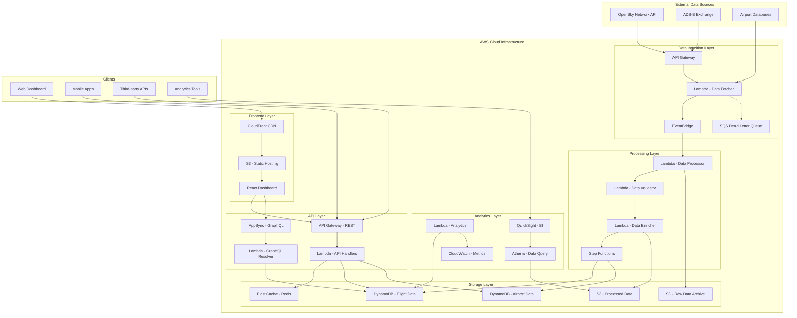
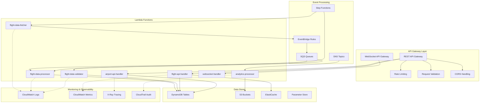
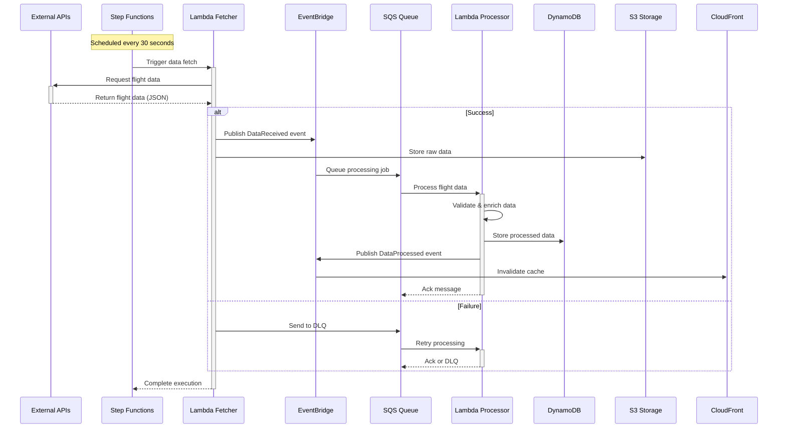
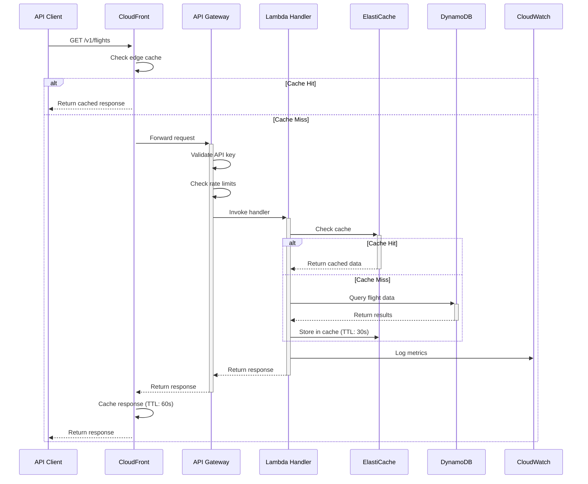
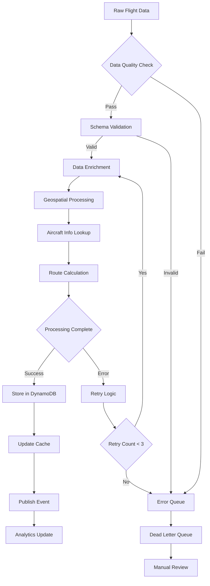

# Technical Architecture Document
## Flight Data Pipeline System

### 📋 Table of Contents

- [System Overview](#system-overview)
- [Architecture Diagrams](#architecture-diagrams)
- [Data Flow](#data-flow)
- [Component Design](#component-design)
- [Technology Stack](#technology-stack)
- [Design Decisions](#design-decisions)
- [Security Architecture](#security-architecture)
- [Performance & Scalability](#performance--scalability)

## 🏗️ System Overview

The Flight Data Pipeline is a cloud-native, event-driven system designed to collect, process, and serve real-time flight data at scale. The architecture follows microservices patterns with serverless compute, managed databases, and event-driven communication.

### Key Characteristics
- **Real-time Processing**: Sub-second data ingestion and processing
- **High Availability**: 99.9% uptime with multi-region deployment
- **Scalability**: Auto-scaling to handle 10M+ requests/day
- **Cost Optimization**: Serverless-first approach with pay-per-use pricing
- **Data Quality**: Built-in validation and enrichment pipelines

## 📊 Architecture Diagrams

### High-Level System Architecture



### Detailed Component Architecture



## 🔄 Data Flow

### Real-time Data Ingestion Flow



### API Request Flow



### Data Processing Pipeline



## 🧩 Component Design

### Lambda Functions Architecture

#### 1. Flight Data Fetcher
```yaml
Function: flight-data-fetcher
Runtime: Python 3.11
Memory: 512 MB
Timeout: 5 minutes
Trigger: EventBridge (every 30 seconds)

Environment Variables:
  - OPENSKY_API_URL
  - OPENSKY_USERNAME (from SSM)
  - OPENSKY_PASSWORD (from SSM)
  - S3_RAW_BUCKET
  - EVENTBRIDGE_BUS_NAME

Permissions:
  - S3: PutObject on raw data bucket
  - EventBridge: PutEvents
  - SSM: GetParameter (for credentials)
  - CloudWatch: Logs and Metrics
```

#### 2. Flight Data Processor
```yaml
Function: flight-data-processor
Runtime: Python 3.11
Memory: 1024 MB
Timeout: 15 minutes
Trigger: SQS Queue (batch size: 10)

Environment Variables:
  - DYNAMODB_FLIGHTS_TABLE
  - DYNAMODB_AIRPORTS_TABLE
  - REDIS_CLUSTER_ENDPOINT
  - GEOCODING_API_KEY

Permissions:
  - DynamoDB: Read/Write on flights and airports tables
  - ElastiCache: Redis cluster access
  - SQS: ReceiveMessage, DeleteMessage
  - EventBridge: PutEvents
```

#### 3. API Handler Functions
```yaml
Function: flight-api-handler
Runtime: Python 3.11
Memory: 256 MB
Timeout: 30 seconds
Trigger: API Gateway

Layers:
  - aws-lambda-powertools
  - requests-layer
  - geopy-layer

Environment Variables:
  - DYNAMODB_FLIGHTS_TABLE
  - REDIS_CLUSTER_ENDPOINT
  - CORS_ORIGINS
  - MAX_PAGE_SIZE: 1000

Reserved Concurrency: 100
Provisioned Concurrency: 10 (for warm starts)
```

### Database Design

#### DynamoDB Tables

##### Flights Table
```json
{
  "TableName": "flightdata-flights-prod",
  "AttributeDefinitions": [
    {"AttributeName": "icao24", "AttributeType": "S"},
    {"AttributeName": "timestamp", "AttributeType": "N"},
    {"AttributeName": "region_time", "AttributeType": "S"}
  ],
  "KeySchema": [
    {"AttributeName": "icao24", "KeyType": "HASH"},
    {"AttributeName": "timestamp", "KeyType": "RANGE"}
  ],
  "GlobalSecondaryIndexes": [
    {
      "IndexName": "RegionTimeIndex",
      "KeySchema": [
        {"AttributeName": "region_time", "KeyType": "HASH"},
        {"AttributeName": "timestamp", "KeyType": "RANGE"}
      ],
      "Projection": {"ProjectionType": "ALL"}
    }
  ],
  "BillingMode": "PAY_PER_REQUEST",
  "StreamSpecification": {
    "StreamEnabled": true,
    "StreamViewType": "NEW_AND_OLD_IMAGES"
  },
  "PointInTimeRecoverySpecification": {"PointInTimeRecoveryEnabled": true}
}
```

##### Airports Table
```json
{
  "TableName": "flightdata-airports-prod",
  "AttributeDefinitions": [
    {"AttributeName": "icao_code", "AttributeType": "S"},
    {"AttributeName": "country_region", "AttributeType": "S"},
    {"AttributeName": "iata_code", "AttributeType": "S"}
  ],
  "KeySchema": [
    {"AttributeName": "icao_code", "KeyType": "HASH"}
  ],
  "GlobalSecondaryIndexes": [
    {
      "IndexName": "CountryRegionIndex",
      "KeySchema": [
        {"AttributeName": "country_region", "KeyType": "HASH"}
      ]
    },
    {
      "IndexName": "IataCodeIndex", 
      "KeySchema": [
        {"AttributeName": "iata_code", "KeyType": "HASH"}
      ]
    }
  ],
  "BillingMode": "PAY_PER_REQUEST"
}
```

#### S3 Bucket Structure
```
flightdata-storage-prod/
├── raw/
│   ├── year=2024/month=01/day=15/hour=14/
│   │   ├── flights-20240115-140000.json.gz
│   │   └── flights-20240115-143000.json.gz
│   └── airports/
│       └── airports-reference-20240101.json
├── processed/
│   ├── flights/
│   │   ├── year=2024/month=01/day=15/
│   │   │   ├── region=europe/flights.parquet
│   │   │   └── region=americas/flights.parquet
│   │   └── aggregates/
│   │       └── daily/2024-01-15-summary.json
│   └── analytics/
│       ├── traffic-density/
│       └── route-statistics/
└── exports/
    ├── user-exports/
    └── scheduled-reports/
```

## 💻 Technology Stack

### Cloud Infrastructure (AWS)
```yaml
Compute:
  - AWS Lambda (Serverless functions)
  - AWS Step Functions (Workflow orchestration)
  - AWS Fargate (Container workloads - future)

Storage:
  - Amazon DynamoDB (NoSQL database)
  - Amazon S3 (Object storage)
  - Amazon ElastiCache Redis (In-memory cache)
  - AWS Systems Manager Parameter Store (Configuration)

Networking:
  - Amazon API Gateway (REST & WebSocket APIs)
  - Amazon CloudFront (CDN)
  - AWS AppSync (GraphQL API - future)
  - Amazon VPC (Network isolation)

Integration:
  - Amazon EventBridge (Event routing)
  - Amazon SQS (Message queuing)
  - Amazon SNS (Notifications)

Monitoring:
  - Amazon CloudWatch (Metrics & Logs)
  - AWS X-Ray (Distributed tracing)
  - AWS CloudTrail (API auditing)

Analytics:
  - Amazon Athena (SQL queries on S3)
  - Amazon QuickSight (Business Intelligence)
  - AWS Glue (Data catalog & ETL)
```

### Development Stack
```yaml
Languages:
  - Python 3.11 (Backend services)
  - JavaScript/TypeScript (Frontend)
  - SQL (Analytics queries)
  - YAML (Infrastructure as Code)

Frameworks & Libraries:
  Backend:
    - AWS Lambda Powertools (Python)
    - Boto3 (AWS SDK)
    - Pydantic (Data validation)
    - Requests (HTTP client)
    - GeoPy (Geospatial processing)
    
  Frontend:
    - React 18
    - TypeScript
    - Material-UI
    - React Query
    - Leaflet (Maps)
    - Chart.js (Visualizations)

Infrastructure:
  - AWS CDK (Infrastructure as Code)
  - Docker (Local development)
  - GitHub Actions (CI/CD)
  - Terraform (Alternative IaC)

Development Tools:
  - Poetry (Python dependency management)
  - Pre-commit hooks (Code quality)
  - Black (Python formatting)
  - ESLint/Prettier (JavaScript formatting)
  - pytest (Python testing)
  - Jest (JavaScript testing)
```

### Third-party Services
```yaml
Data Sources:
  - OpenSky Network API (Primary flight data)
  - ADS-B Exchange (Backup flight data)
  - OurAirports Database (Airport information)

External APIs:
  - Google Maps API (Geocoding - future)
  - Weather API (Weather data - future)
  - Aircraft Database API (Aircraft details - future)

Monitoring:
  - Datadog (APM - optional)
  - Sentry (Error tracking - future)
  - PagerDuty (Alerting - production)
```

## 🎯 Design Decisions

### 1. Serverless-First Architecture

**Decision**: Use AWS Lambda for all compute workloads
```yaml
Rationale:
  - Cost Efficiency: Pay only for actual usage
  - Auto Scaling: Handles traffic spikes automatically
  - Maintenance: No server management required
  - Development Speed: Focus on business logic

Trade-offs:
  - Cold Starts: Initial latency for infrequent functions
  - Vendor Lock-in: AWS-specific implementation
  - Debugging Complexity: Distributed system challenges
  - Resource Limits: 15-minute max execution time

Mitigations:
  - Provisioned Concurrency: For critical functions
  - Keep Functions Warm: Periodic invocation
  - Multi-cloud Strategy: Planned for future
  - Function Composition: Break down long processes
```

### 2. NoSQL Database Choice

**Decision**: DynamoDB as primary database
```yaml
Rationale:
  - Performance: Single-digit millisecond latency
  - Scalability: Handles millions of requests/second
  - Managed Service: No database administration
  - Cost Model: Pay per request pricing

Trade-offs:
  - Query Flexibility: Limited compared to SQL
  - Learning Curve: NoSQL data modeling complexity
  - Vendor Lock-in: AWS-specific features

Mitigations:
  - Careful Schema Design: Optimize access patterns
  - Global Secondary Indexes: Support multiple queries
  - DynamoDB Streams: Event-driven architectures
  - Data Export: Regular backups to S3
```

### 3. Event-Driven Architecture

**Decision**: EventBridge for service communication
```yaml
Rationale:
  - Decoupling: Services communicate asynchronously
  - Scalability: Handle high-volume events
  - Reliability: Built-in retry and DLQ
  - Extensibility: Easy to add new consumers

Implementation:
  Event Types:
    - FlightDataReceived
    - FlightDataProcessed
    - DataQualityAlert
    - RateLimitExceeded
    - SystemHealthCheck

  Event Flow:
    Producer → EventBridge → Rule → Target (Lambda/SQS)
```

### 4. Caching Strategy

**Decision**: Multi-layered caching approach
```yaml
Layers:
  1. CloudFront (Edge caching): 60-second TTL
  2. ElastiCache Redis (Application caching): 30-second TTL
  3. DynamoDB (Database caching): Built-in caching

Cache Keys:
  - API Responses: "flights:bounds:{hash}:page:{n}"
  - Airport Data: "airport:{icao_code}"
  - Analytics: "analytics:{type}:{timerange}:{hash}"

Invalidation Strategy:
  - Time-based expiration
  - Event-driven invalidation
  - Manual cache clearing for emergencies
```

### 5. Data Partitioning Strategy

**Decision**: Time and geographic-based partitioning
```yaml
DynamoDB Partitioning:
  Primary Key: icao24 (Aircraft identifier)
  Sort Key: timestamp (Time-based ordering)
  GSI: region_time (Geographic + temporal queries)

S3 Partitioning:
  Path: /year=YYYY/month=MM/day=DD/hour=HH/
  Benefits:
    - Efficient date-range queries
    - Parallel processing
    - Lifecycle management
    - Cost optimization

Rationale:
  - Query Patterns: Most queries are time-based
  - Hot Partitioning: Distribute load evenly
  - Data Lifecycle: Older data accessed less frequently
```

### 6. API Design Philosophy

**Decision**: RESTful API with GraphQL option
```yaml
REST API:
  - Simple to understand and implement
  - Wide client support
  - HTTP caching benefits
  - Clear resource-based URLs

GraphQL (Planned):
  - Flexible data fetching
  - Reduces over/under-fetching
  - Single endpoint
  - Real-time subscriptions

API Versioning:
  Strategy: URL path versioning (/v1/, /v2/)
  Rationale: Clear, explicit, and cacheable
```

## 🔐 Security Architecture

### Authentication & Authorization
```yaml
API Authentication:
  Method: API Key in X-API-Key header
  Storage: AWS API Gateway usage plans
  Rotation: 90-day automatic rotation
  Scoping: Per-client rate limits and quotas

Future Enhancements:
  - OAuth 2.0 / JWT tokens
  - Role-based access control (RBAC)
  - IP whitelisting
  - Request signing (HMAC)
```

### Data Protection
```yaml
Encryption:
  In Transit:
    - TLS 1.3 for all API endpoints
    - Certificate management via ACM
    - HTTPS redirect enforcement
  
  At Rest:
    - DynamoDB: AWS managed keys
    - S3: AES-256 encryption
    - ElastiCache: Encryption at rest and in transit
    - Lambda: Environment variables encrypted

Access Control:
  - IAM roles with least privilege principle
  - VPC endpoints for AWS service access
  - Security groups and NACLs
  - CloudTrail for audit logging
```

### Security Monitoring
```yaml
Threat Detection:
  - AWS GuardDuty (Threat detection)
  - AWS Config (Compliance monitoring)
  - CloudWatch alarms (Anomaly detection)
  - API Gateway throttling (DDoS protection)

Incident Response:
  - Automated alerting via SNS
  - Runbook automation
  - Security event logging
  - Regular security reviews
```

## ⚡ Performance & Scalability

### Performance Targets
```yaml
Latency Requirements:
  - API Response Time: < 200ms (P95)
  - Data Processing: < 5 minutes end-to-end
  - Cache Hit Ratio: > 80%
  - Error Rate: < 0.1%

Throughput Requirements:
  - API Requests: 10,000 requests/minute
  - Data Ingestion: 1MB/minute sustained
  - Concurrent Users: 1,000 simultaneous
  - Geographic Distribution: Global access
```

### Scalability Design
```yaml
Horizontal Scaling:
  - Lambda: Automatic scaling up to 1,000 concurrent executions
  - DynamoDB: On-demand scaling
  - API Gateway: Handles any traffic volume
  - CloudFront: Global edge locations

Vertical Scaling:
  - Lambda Memory: 128MB to 10GB per function
  - DynamoDB: Provisioned capacity for predictable workloads
  - ElastiCache: Cluster scaling for memory needs

Auto-scaling Policies:
  - CPU-based: Scale when CPU > 70%
  - Request-based: Scale when requests > threshold
  - Schedule-based: Pre-scale for known peaks
  - Predictive scaling: ML-based scaling (future)
```

### Performance Optimization
```yaml
Database Optimization:
  - Query optimization with proper indexes
  - Connection pooling
  - Read replicas for read-heavy workloads
  - Data archiving for historical data

Application Optimization:
  - Function warming strategies
  - Async processing for non-critical tasks
  - Batch processing for bulk operations
  - Memory-efficient data structures

Network Optimization:
  - CDN for static content and API responses
  - Compression (gzip) for API responses
  - Keep-alive connections
  - Geographic distribution of resources
```

## 🔍 Monitoring & Observability

### Metrics Collection
```yaml
Business Metrics:
  - API response times by endpoint
  - Data freshness and quality scores
  - User engagement and retention
  - Cost per request and data point

System Metrics:
  - Lambda function duration and errors
  - DynamoDB throttling and capacity
  - API Gateway request counts and latency
  - Cache hit rates and memory usage

Custom Metrics:
  - Flight data accuracy scores
  - Geographic coverage metrics
  - Data pipeline health scores
  - Client application performance
```

### Logging Strategy
```yaml
Centralized Logging:
  - All logs aggregated in CloudWatch Logs
  - Structured JSON logging format
  - Log retention policies (30 days default)
  - Log encryption and access controls

Log Levels:
  - ERROR: System errors and failures
  - WARN: Performance issues and anomalies
  - INFO: Business events and milestones
  - DEBUG: Detailed troubleshooting info (dev only)

Correlation:
  - Request ID tracking across services
  - User session tracking
  - Distributed tracing with X-Ray
  - Error context and stack traces
```

### Alerting & Notifications
```yaml
Alert Categories:
  Critical:
    - API error rate > 1%
    - Data pipeline failure
    - Security breach detection
    - Service unavailability
  
  Warning:
    - Response time > 500ms
    - Cache hit rate < 70%
    - Cost anomaly detection
    - Data quality issues

Notification Channels:
  - Email for non-urgent alerts
  - SMS for critical issues
  - Slack for team notifications
  - PagerDuty for escalation (production)
```

---

This technical architecture document provides a comprehensive view of the system design, technology choices, and implementation decisions. The architecture is designed for scalability, reliability, and cost-effectiveness while maintaining high performance and security standards.